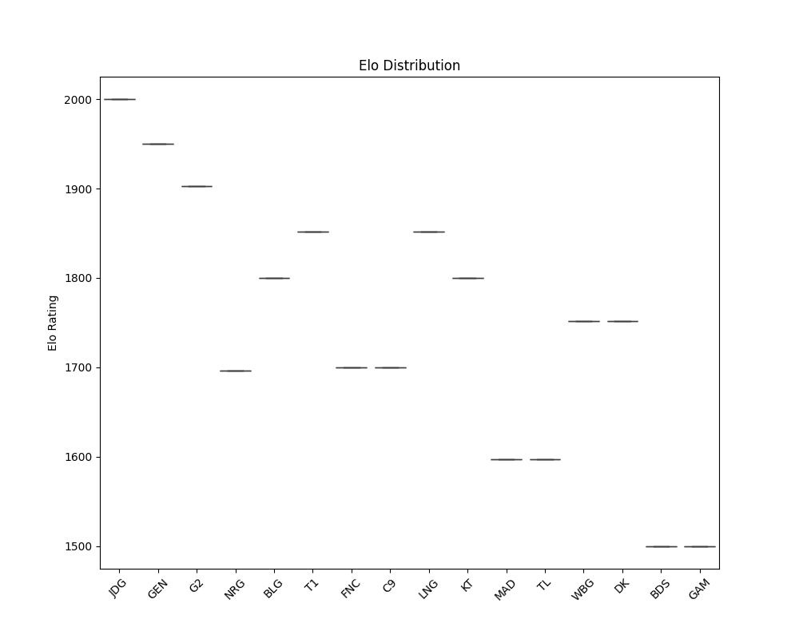
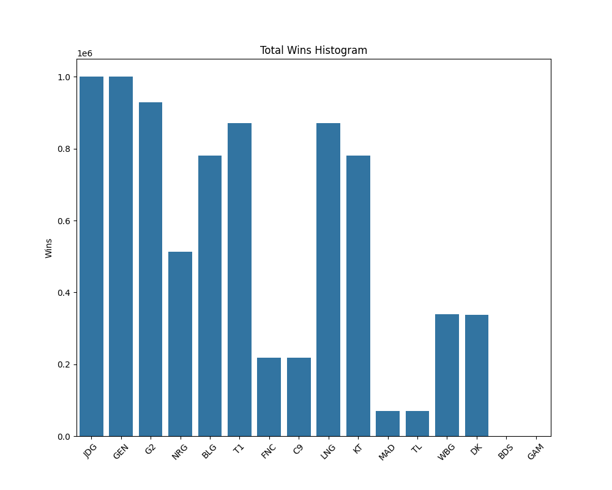
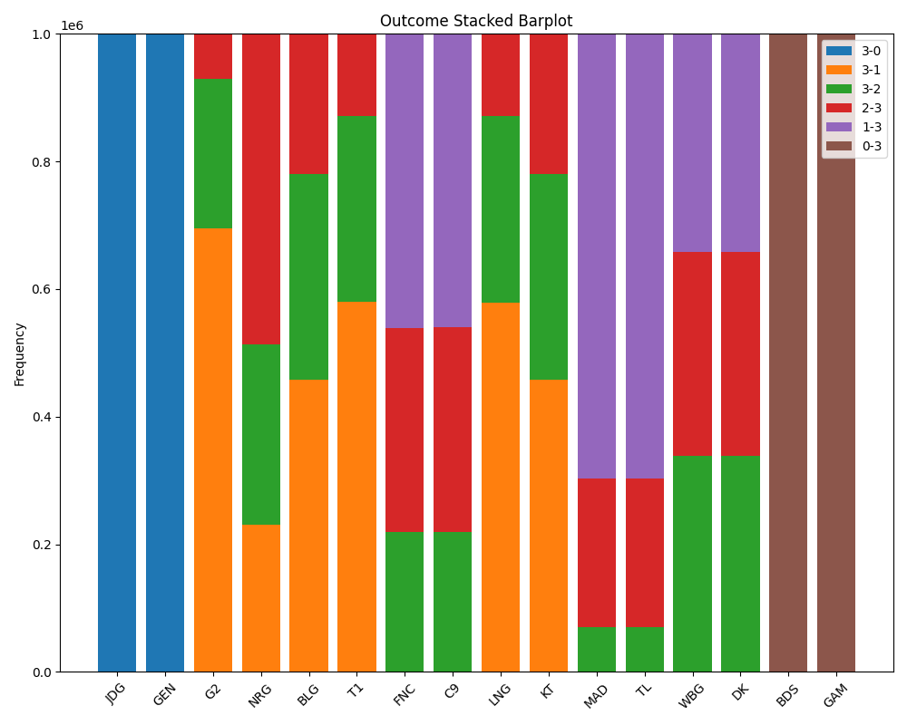
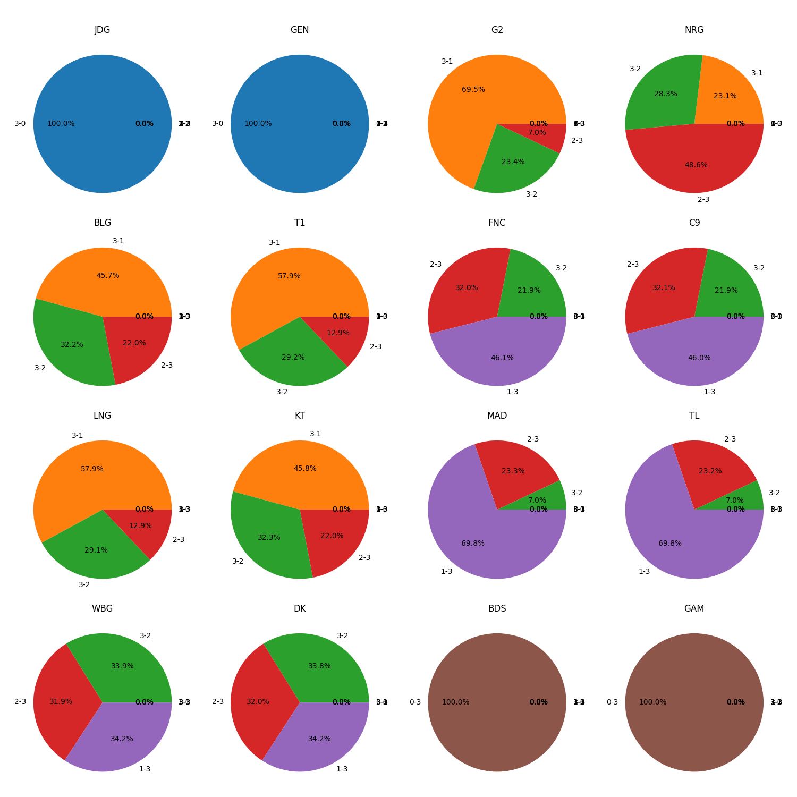

# Swiss System Simulation for LoL S13

## Introduction
This program simulates the results of the Swiss System for the League of Legends (LoL) Season 13 (S13). The Swiss system is a common format in eSports and traditional sports tournaments, especially when a large number of teams need to be narrowed down to a select few. 

To determine the strength and win probability of each team, this simulation uses the ELO rating mechanism. Each team starts with a given ELO, which represents their initial strength. After each matchup, the teams' ELO ratings get updated based on the outcome and the ELO difference between the teams.

### ELO Score Mechanism

ELO rating system is a method to calculate the relative skill levels of players. In our simulation, it's used to estimate the strength and win probability of each team.

**ELO Score Update Formula:**
\[ \text{New ELO}_{\text{A}} = \text{Old ELO}_{\text{A}} + K \times (\text{Result}_{\text{A}} - \text{Expected Result}_{\text{A}}) \]
Where:
- \(\text{New ELO}_{\text{A}}\) is the updated ELO score for team A.
- \(\text{Old ELO}_{\text{A}}\) is the previous ELO score for team A.
- \(K\) is a factor that determines the maximum change in rating (which can be adjusted based on the difference in ELO scores between the two teams, as defined in the function `get_k_value`).
- \(\text{Result}_{\text{A}}\) is the actual result of the match (1 for a win, 0.5 for a draw, and 0 for a loss).
- \(\text{Expected Result}_{\text{A}}\) is the expected result for team A against team B, calculated using the win probability formula below.

**Win Probability Formula:**
\[ P(\text{A wins}) = \frac{1}{1 + 10^{\frac{\text{ELO}_{\text{B}} - \text{ELO}_{\text{A}}}{400}}} \]
Where:
- \(P(\text{A wins})\) is the probability of team A winning against team B.
- \(\text{ELO}_{\text{A}}\) and \(\text{ELO}_{\text{B}}\) are the ELO scores of team A and team B respectively.

## Dynamic K-Factor Adjustment
In ELO systems, the K-factor determines the magnitude of ELO adjustments after each match. A higher K-value results in larger rating changes. In this simulation, the K-factor dynamically adjusts based on the ELO difference between the two teams. This ensures that upsets (where a lower-rated team beats a higher-rated team) have a more significant impact on ratings. 

The dynamic adjustment is implemented as (you can change it by yourself):

```python
def get_k_value(elo_diff):
    if elo_diff > 400:  
        return 64
    elif 200 <= elo_diff <= 400:  
        return 48
    elif 100 <= elo_diff <= 200:
        return 32
    else:  
        return 24
```

## Visualizing the Simulation Results

Several plots have been generated to help visualize the results of the simulation:

- **ELO Distribution** (`figs/elo_distribution.png`): Displays the distribution of ELO scores for all teams at the end of the simulation.
  
  

- **Histogram of Wins** (`figs/histogram.png`): Represents the qualified possibility for each team.
  
  

- **Pie Chart of Wins and Losses** (`figs/pie_chart.png`): Illustrates the proportion of qualified probability for each team.
  
  

- **Stacked Barplot** (`figs/stacked_barplot.png`): Visualizes the win-loss ratio for each team in a barplot.
  
  

- **Win-Loss Heatmap** (`figs/win_loss_heatmap.png`): Visualizes the win-loss ratio for each team in a heatmap.
  
  

- **Win-Loss Pie Charts** (`figs/win_loss_pie_charts.png`): Visualizes the win-loss ratio for each team in a series of pie charts.
  
  

- **Win Rate Heatmap** (`figs/win_rate_heatmap.png`): Provides a heatmap representation of each team's win rate against every other team.
  
  

## Conclusion

This simulation offers insights into how the Swiss System can unfold for LoL S13 based on the ELO rating mechanism. It provides a deeper understanding of the dynamics of matchups and helps to anticipate possible outcomes. Note that, while informative, these are simulated results, and real-world outcomes can vary based on a multitude of factors.